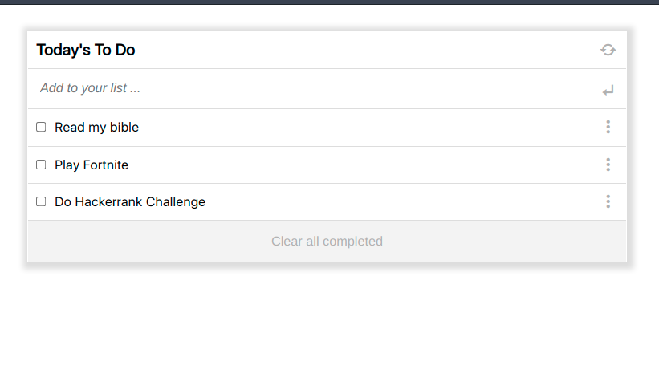

# To-Do 
To-Do is a web application that allows users 
* Add tasks to a list
* Remove completed tasks individually and collectively
* Rearrage tasks on the list by means of drag and drop



## Built With
* HTML
* CSS
* JS
* Webpack

## System Requirements
* Node.JS
* npm
* Code Editor
* Git

## Installation
* Clone the repo using the command below

```
git clone git@github.com:charlesgobina/to-do.git
```

* Navigate to the directory in which you cloned the project and use the command below

```
cd to-do
```

* Install all project dependencies and packages using the command below

```
npm install
```

* Build the project using the command below

```
npm run build
```

* Start the server to run the application locally using the command below

```
npm start
```

## Authors
Charles Gobina :student: 
* Github:https://github.com/charlesgobina 
* Twitter:https://twitter.com/i4mCloud
* LinkedIn:https://www.linkedin.com/in/charles-gobina-74a0ab193/

## Contributing :handshake:
Contributions, issues, and feature requests are welcome!
* Fork this repo using the command below

```
gh repo fork git@github.com:charlesgobina/to-do.git
```
* Clone the forked repo using the command below

```
git clone git@github.com:charlesgobina/to-do.git
```

* Navigate to the directory in which you cloned the project and use the command below

```
cd to-do
```

* Create a new feature branch using the command below

```
git checkout -b [name_of_feature_branch]
```

* Commit your changes using git commit as shown below

```
git commit -m ["entere a commit message"]
```

* Push your changes using

```
git push -u origin [name_of_feature_branch]
```
* Open pull request.


## Show your support
Give a 	:star: if you like this project.

## Acknowledgments
* Hat tip to anyone whose code was used
* Inspiration
* etc

## License :memo:
This project is [MIT](https://github.com/microverseinc/readme-template/blob/master/MIT.md) licensed